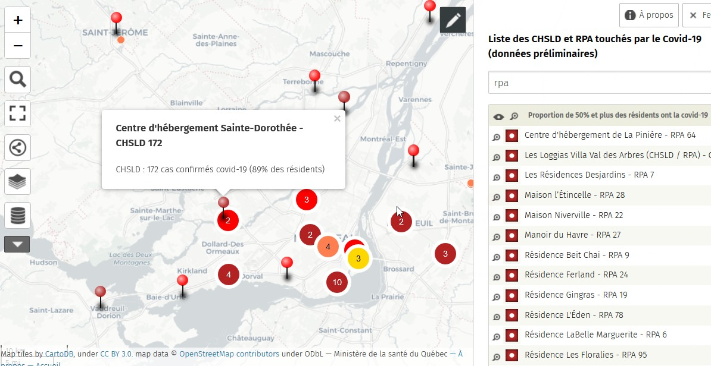

# Données sur l'évolution de l'épidémie de COVID-19

## Québec, Statistiques COVID-19 publiées par l'INSPQ et les autorités régionales de santé

- [INSPQ Données COVID-19 au Québec](https://www.inspq.qc.ca/covid-19/donnees) Mise-à-jour quotidienne ([@INSPQ](https://twitter.com/INSPQ))
- [INSPQ Données détaillées COVID-19 au Québec ](https://www.inspq.qc.ca/covid-19/donnees/details) Mise-à-jour quotidienne
- [Santé Montréal](https://santemontreal.qc.ca/population/coronavirus-covid-19/#c36391) Mise-à-jour quotidienne ([@Santepub_Mtl](https://twitter.com/Santepub_Mtl))
- [Santé Laurentides](http://www.santelaurentides.gouv.qc.ca/nc/sante-publique/maladies-infectieuses/covid-19-coronavirus/situation-dans-les-laurentides/) Mise-à-jour quotidienne ([@CisssL](https://twitter.com/CisssL))
- [Santé-Lanaudière](http://www.cisss-lanaudiere.gouv.qc.ca/coronavirus/nombre-de-cas/) [@CISSSLanaudiere](https://twitter.com/CISSSLanaudiere)
- [Santé Capitale-nationale](https://www.ciusss-capitalenationale.gouv.qc.ca/)
- [Santé Bas-Saint-Laurent](https://www.cisss-bsl.gouv.qc.ca/vivre-en-sante/maladies-infectieuses/coronavirus-covid-19/etat-de-la-situation) Mise-à-jour quotidienne ([@CISSSBSL](https://twitter.com/CISSSBSL))
- [Santé Estrie @CIUSSSE_CHUS](https://twitter.com/CIUSSSE_CHUS)
- [Santé Mauricie-Centre-du-Québec @CIUSSSMCQ](https://twitter.com/CIUSSSMCQ)
- [Santé Saguenay-Lac-Saint-Jean @CIUSSS_SLSJ](https://twitter.com/CIUSSS_SLSJ)

## Québec - Tableaux Situation dans les milieux de vie pour personnes aînées et vulnérables (CHSLD, RPA, RI) 

### Ministère de la Santé et des Services Sociaux - Cas cumulatifs
- [Mise-à-jour quotidienne du 14 au 30 avril, interrompue depuis](https://www.quebec.ca/sante/problemes-de-sante/a-z/coronavirus-2019/situation-coronavirus-quebec/#c53630)
- [Archive MSSS - Situation dans les CHSLD et RPA, 2020-04-30](Qc/Tableau-milieux-de-vie-COVID-19-2020-04-30.pdf) MSSS, Québec 

## Québec - Tableaux Situation dans les milieux de vie pour personnes aînées et vulnérables, CHSLD et RPA - Cas actifs et décès  
*NOTE: Variable Cas cumulatifs absente*

- [Situation dans les CHSLD, 2020-05-12](Qc/%C3%89tat%20de%20situation%20des%20cas%20confirm%C3%A9s%20et%20des%20d%C3%A9c%C3%A8s%20COVID-19%20par%20CHSLD%2C%20Qu%C3%A9bec%2C%2012%20mai%202020.pdf) Archive MSSS, Québec 

- [Situation dans les RPA, 2020-05-13](Qc/%C3%89tat%20de%20situation%20des%20cas%20confirm%C3%A9s%20et%20des%20d%C3%A9c%C3%A8s%20COVID-19%20par%20RPA%2C%20Qu%C3%A9bec%2C%2013%20mai%202020.pdf) Archive MSSS, Québec 

### Directions régionales de Santé

**Centre intégré de santé et de services sociaux des Laurentides (CISSSL)**
[Portrait quotidien des milieux de vie pour personnes aînées et vulnérables](http://www.santelaurentides.gouv.qc.ca/nc/sante-publique/maladies-infectieuses/covid-19-coronavirus/situation-dans-les-laurentides/portrait-quotidien-des-milieux-de-vie-pour-personnes-ainees-et-vulnerables/)

-[Portrait, 11 mai](http://www.santelaurentides.gouv.qc.ca/fileadmin/internet/cisss_laurentides/Sante_Publique/Maladies_infectieuses/COVID-19/Situation_dans_les_Laurentides/Portrait_quotidien_des_milieux_de_vie_ajuste_en_date_du_11_mai_2020.pdf)

**Centre intégré de santé et de services sociaux Capitale-Nationale (CIUSSS-Capitale-nationale)**
[COVID-19 Situation dans la Capitale-Nationale](https://www.ciusss-capitalenationale.gouv.qc.ca/)

-[Bilan COVID-19 dans la Capitale-Nationale - 11 mai 2020](https://www.ciusss-capitalenationale.gouv.qc.ca/sites/default/files/00-CORONAVIRUS/Communique/2020-05-11_communique_bilan.pdf)

**Centre intégré de santé et de services sociaux de Lanaudière (CISSS-Lanaudière)**
- [Santé-Lanaudière Mardi et Vendredi](http://www.cisss-lanaudiere.gouv.qc.ca/coronavirus/nombre-de-cas/) [@CISSSLanaudiere](https://twitter.com/CISSSLanaudiere) Voir lien quotidien Milieux de vie

### Carte en ligne, Milieux de vie touchés par la COVID-19, Québec

[CHSLD et RPA touchés par la COVID19 au 2020-04-30, 1 résident et plus (Données du 04-30)

](http://umap.openstreetmap.fr/fr/map/liste-des-chsld-et-rpa-touches-par-le-covid-19-ser_445831#10/45.5244/-73.7189)

